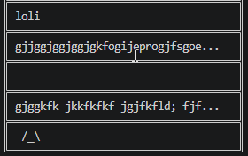
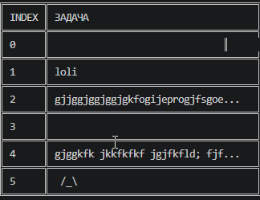
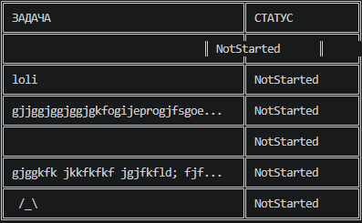

### TC-01 Создание нового пользователя
**Описание:**
Проверка корректного создания нового пользователя в системе.
**Предусловия:**
Приложение запущено. Пользователь не авторизован.
**Последовательность действий:**
1. Запустить приложение.
2. Создаём новый профиль 
3. Ведите логин: `nnonon`
4. Ввести пароль: `12345`.
5. Ввести имя: `Ivan`.
6. Введите Фамилию `Ivanov`
7. Введите Год рождения
**Ожидаемый результат:**
- Пользователь `Ivan` успешно создан.
- В консоли отображается сообщение об успешном создании пользователя.
- Пользователь сохранён в файле данных.
**Скриншоты:**
- 

### TC-02 Добавление задач (add)
**Описание:**
проверка возможности создания задач с конкретными данными
**Предусловия:**
приложение запущено, пользователь авторизован 
**Последовательность действий:**
1. для создания задачи с текстом используется команда add 
2. пишите  add "имя что надо добавить "
3. так с помощью команды add добавляются задачи с пустым именем 
4. создание задачи с пустым именем add "пробел " 
5. создание задачи с блинным текстом add "пишите пишите пишите пишете всё ещё пишите пишите"
6. добавление многострочных используйте команду add  с флагом -m которая позволит в водить много строчный ввод, для авершения используется команда !end 
7. добавление задач с символам иничем не отличается от добавлении задач с обычным названием та же команда add и название "+-+"
**Ожидаемый результат:**
- задачи успешно созданы 
- задачи коректно отображаются 

**Скриншоты:**
- 

### TC-03 Просмотр задач (view)
**Описание:**
просмотр задач командой view 
**Предусловия:**
программа запущена, пользователь авторизирован, задачи существуют 
**Последовательность действий:**
1. если у профилей уже существуют задачи их можно просмотреть командой view 
2. прописываем view 
3. должен вывести список команд 
4. показать view [-i] [-s] [-d] [-a] где 
-i  --index          - показать индекс
-s  --status         - показать статус
-d  --date           - показать дату изменения
-a  --all            - показать всё
**Ожидаемый результат:** 
- задачи выподятся списком 
- задачи коректно отображаются с флагами 

**Скриншоты:**
- 
- 
- 

### TC-04 Обновление задач (update / status)
**Описание:**
Обновление задач через команды update и команды status 
**Предусловия:**
программа запущена, пользователь авторизирован, задачи существуют 
**Последовательность действий:**
