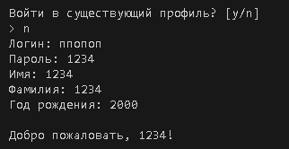

### TC-01 Создание нового пользователя
**Описание:**
Проверка корректного создания нового пользователя в системе.
**Предусловия:**
Приложение запущено. Пользователь не авторизован.
**Последовательность действий:**
1. Запустить приложение.
2. Создаём новый профиль 
3. Ведите логин: `nnonon`
4. Ввести пароль: `12345`.
5. Ввести имя: `Ivan`.
6. Введите Фамилию `Ivanov`
7. Введите Год рождения
**Ожидаемый результат:**
- Пользователь `Ivan` успешно создан.
- В консоли отображается сообщение об успешном создании пользователя.
- Пользователь сохранён в файле данных.
**Скриншоты:**
- 

### TC-02 Добавление задач (add)
**Описание:**

**Предусловия:**

**Последовательность действий:**
1. 
2. 
**Ожидаемый результат:**

**Скриншоты:**
