# Тест-кейсы для приложения TodoList

## 1. Пользователи и авторизация

### TC-01 Регистрация нового пользователя
**Описание:** Проверка возможности создания нового профиля с валидными данными.
**Последовательность действий:**
1. Запустить приложение.
2. На вопрос "Войти в существующий профиль?" ввести `n`.
3. Ввести имя: `Алексей`.
4. Ввести фамилию: `Петров`.
5. Ввести год рождения: `1995`.
6. Ввести логин: `alex_new`.
7. Ввести пароль: `pass123`.
**Ожидаемый результат:**
- Появляется сообщение "Регистрация прошла успешно! Вы вошли в систему."
- Пользователь перенаправляется в главное меню ввода команд.
**Скриншоты:**
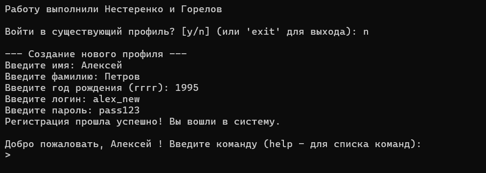

### TC-02 Авторизация (Логин)
**Описание:** Вход в систему под уже существующим пользователем.
**Предусловие:** Пользователь `alex_new` с паролем `pass123` уже существует (из TC-01).
**Последовательность действий:**
1. Перезапустить приложение.
2. На вопрос "Войти в существующий профиль?" ввести `y`.
3. Ввести логин: `alex_new`.
4. Ввести пароль: `pass123`.
**Ожидаемый результат:**
- Появляется сообщение "Вход выполнен успешно!".
- Приветствие "Добро пожаловать, Алексей!".
**Скриншоты:**
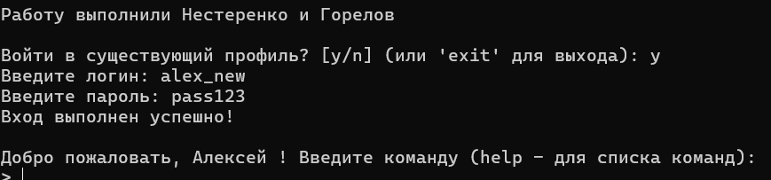

### TC-03 Ошибка авторизации
**Описание:** Проверка реакции системы на неверный пароль.
**Последовательность действий:**
1. Запустить приложение.
2. Выбрать `y` (вход).
3. Ввести логин: `alex_new`.
4. Ввести неверный пароль: `wrongpass`.
**Ожидаемый результат:**
- Появляется сообщение "Неверный логин или пароль."
- Приложение снова предлагает выбрать действие (Войти/Зарегистрироваться).
**Скриншоты:**
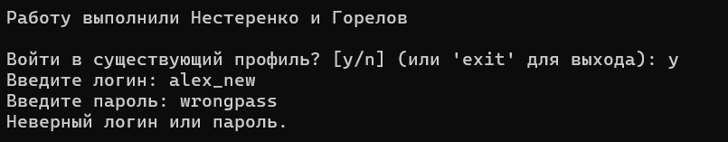

### TC-04 Выход из профиля
**Описание:** Проверка команды выхода из текущего аккаунта.
**Последовательность действий:**
1. Авторизоваться в системе.
2. Ввести команду `profile -o` (или `profile --out`).
**Ожидаемый результат:**
- Сообщение "Пользователь [login] вышел."
- Возврат к начальному меню (вопрос о входе).
**Скриншоты:**
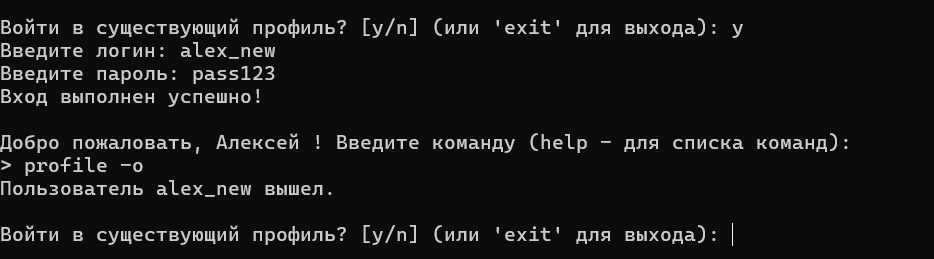

---

## 2. Добавление задач (Add)

### TC-05 Добавление простой задачи
**Описание:** Добавление задачи в одну строку.
**Последовательность действий:**
1. Авторизоваться.
2. Ввести команду: `add Купить молоко`.
**Ожидаемый результат:**
- Сообщение "Задача добавлена!".
- При вызове `view` задача отображается в списке.
**Скриншоты:**
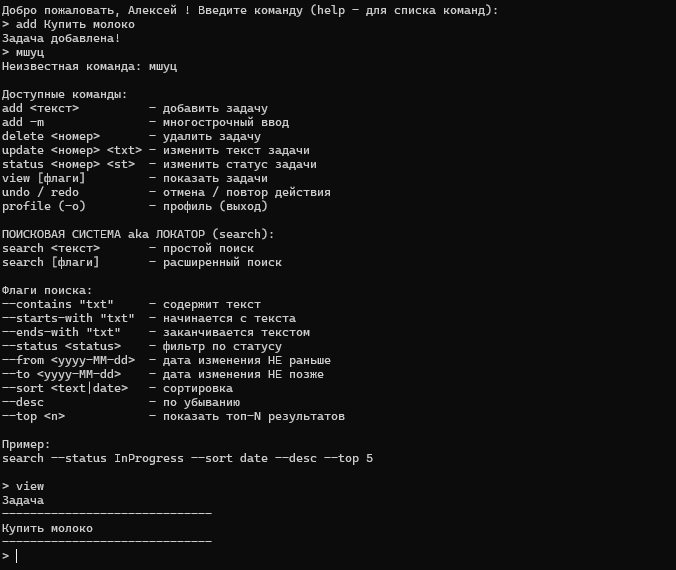

### TC-06 Добавление пустой задачи (Валидация)
**Описание:** Попытка добавить задачу без текста.
**Последовательность действий:**
1. Ввести команду: `add` (без аргументов) или пробелы.
**Ожидаемый результат:**
- Сообщение "Текст задачи не может быть пустым."
- Задача не добавляется.
**Скриншоты:**
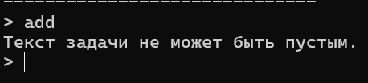

### TC-07 Добавление задачи со спецсимволами
**Описание:** Проверка обработки символов разделителей CSV (точка с запятой, кавычки).
**Последовательность действий:**
1. Ввести команду: `add Задача с "кавычками" и ; точкой с запятой`.
2. Ввести команду `view`.
**Ожидаемый результат:**
- Задача успешно добавлена.
- При просмотре текст отображается корректно, символы не ломают разметку.
**Скриншоты:**
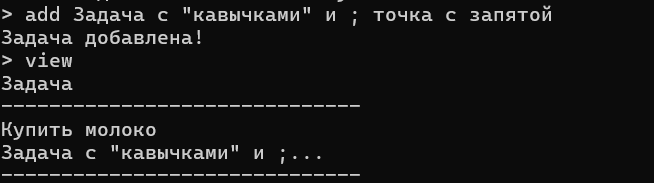

### TC-08 Многострочная задача
**Описание:** Использование флага `-m` для ввода длинного текста.
**Последовательность действий:**
1. Ввести команду: `add -m`.
2. Ввести строку 1: `Составить план`.
3. Ввести строку 2: `1. Учеба`.
4. Ввести строку 3: `2. Отдых`.
5. Ввести команду завершения: `!end`.
**Ожидаемый результат:**
- Сообщение "Задача добавлена!".
- При просмотре `view` текст отображается корректно (с переносами или урезанно с многоточием в зависимости от вида просмотра).
**Скриншоты:**
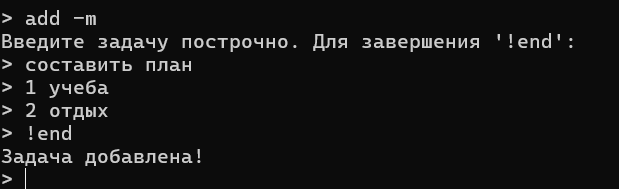

---

## 3. Просмотр задач (View)

### TC-09 Просмотр всех задач (флаги)
**Описание:** Проверка команды `view` с флагами отображения всей информации.
**Последовательность действий:**
1. Иметь в списке несколько задач.
2. Ввести команду: `view -a` (или `view --all`).
**Ожидаемый результат:**
- Отображается таблица задач.
- Видны колонки: №, Задача, Статус, Дата обновления.
**Скриншоты:**
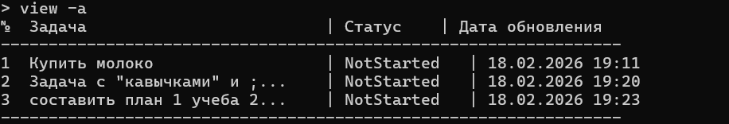

### TC-10 Просмотр при пустом списке
**Описание:** Реакция системы на отсутствие задач.
**Предусловие:** Новый пользователь или все задачи удалены.
**Последовательность действий:**
1. Ввести команду `view`.
**Ожидаемый результат:**
- Сообщение "Нет задач."
**Скриншоты:**
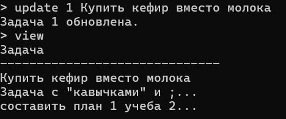

---

## 4. Обновление задач (Update / Status)

### TC-11 Обновление текста задачи
**Описание:** Изменение формулировки существующей задачи.
**Последовательность действий:**
1. Выполнить `view`, запомнить номер задачи (например, 1).
2. Ввести: `update 1 Купить кефир вместо молока`.
**Ожидаемый результат:**
- Сообщение "Задача 1 обновлена."
- При повторном `view` текст задачи изменился, дата обновления обновилась.
**Скриншоты:**
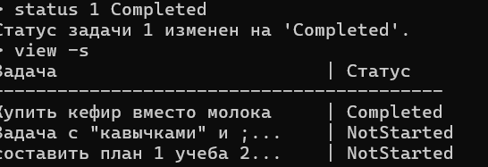

### TC-12 Изменение статуса
**Описание:** Перевод задачи в статус "Выполнено".
**Последовательность действий:**
1. Ввести: `status 1 Completed`.
2. Ввести `view -s` (показать со статусами).
**Ожидаемый результат:**
- Сообщение "Статус задачи 1 изменен на 'Completed'."
- В списке статус отображается как `Completed`.
**Скриншоты:**
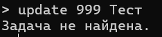

### TC-13 Ошибка обновления (Неверный ID)
**Описание:** Попытка обновить несуществующую задачу.
**Последовательность действий:**
1. Ввести: `update 999 Тест`.
**Ожидаемый результат:**
- Сообщение "Задача с таким номером нет." или "Индекс находится за пределами списка".
**Скриншоты:**
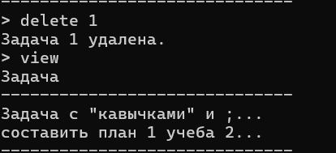

---

## 5. Удаление задач (Delete)

### TC-14 Удаление задачи
**Описание:** Удаление существующей задачи по индексу.
**Последовательность действий:**
1. Ввести `view`, выбрать номер (например, 1).
2. Ввести `delete 1`.
3. Ввести `view`.
**Ожидаемый результат:**
- Сообщение "Задача 1 удалена."
- В списке задача отсутствует. Нумерация оставшихся задач сместилась.
**Скриншоты:**
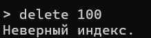

### TC-15 Удаление несуществующей задачи
**Описание:** Попытка удалить задачу с неверным индексом.
**Последовательность действий:**
1. Ввести `delete 100`.
**Ожидаемый результат:**
- Сообщение "Задачи с таким номером нет."
**Скриншоты:**
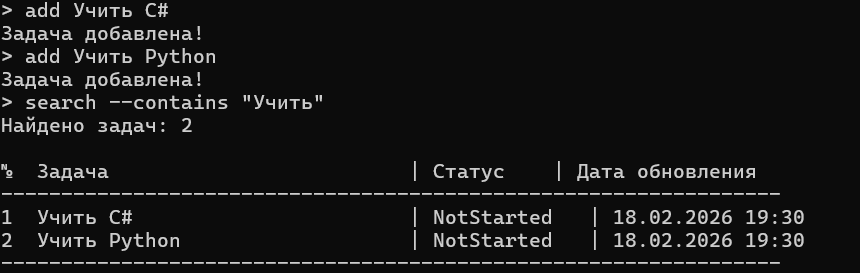

---

## 6. Поиск (Search)

### TC-16 Поиск по вхождению текста
**Описание:** Поиск задач, содержащих подстроку.
**Предусловие:** Добавить задачи "Учить C#" и "Учить Python".
**Последовательность действий:**
1. Ввести `search --contains "Учить"`.
**Ожидаемый результат:**
- Найдены 2 задачи.
- Выводится список найденного.
**Скриншоты:**
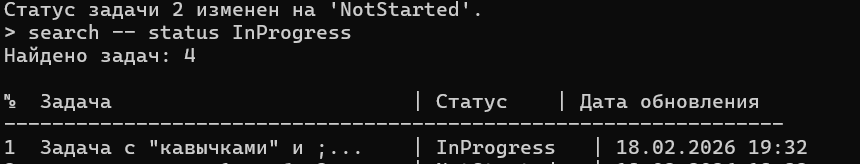

### TC-17 Поиск по статусу
**Описание:** Фильтрация задач по статусу.
**Предусловие:** Одна задача `InProgress`, другая `NotStarted`.
**Последовательность действий:**
1. Ввести `search --status InProgress`.
**Ожидаемый результат:**
- В результатах только задачи со статусом InProgress.
**Скриншоты:**
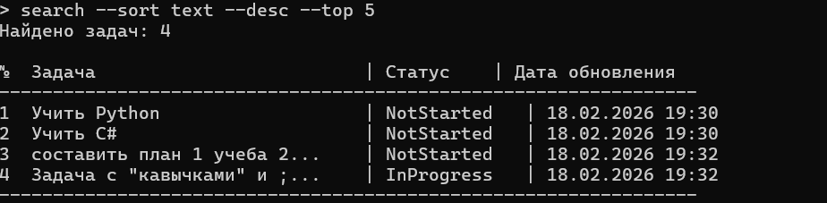

### TC-18 Сложный поиск с сортировкой
**Описание:** Комбинация условий и сортировка.
**Последовательность действий:**
1. Ввести `search --sort text --desc --top 5`.
**Ожидаемый результат:**
- Выводится до 5 задач.
- Задачи отсортированы по алфавиту в обратном порядке (Z-A).
**Скриншоты:**
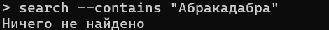

### TC-19 Поиск без результатов
**Описание:** Поиск строки, которой нет ни в одной задаче.
**Последовательность действий:**
1. Ввести `search --contains "Абракадабра"`.
**Ожидаемый результат:**
- Сообщение "Ничего не найдено".
**Скриншоты:**
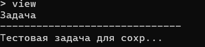

---

## 7. Работа с файлами

### TC-20 Сохранение данных после выхода
**Описание:** Проверка корректного сохранения задач и статусов на диск после закрытия приложения.
**Предусловия:**
1. Пользователь авторизован.
2. Список задач пуст.
**Последовательность действий:**
1. Ввести команду `add Тестовая задача для сохранения`.
2. Ввести команду `status 1 InProgress`.
3. Ввести команду `exit`.
4. Заново запустить приложение и авторизоваться.
5. Ввести команду `view`.
**Ожидаемый результат:**
- Задача "Тестовая задача для сохранения" присутствует в списке.
- Статус задачи отображается как `InProgress`.
**Скриншоты:**
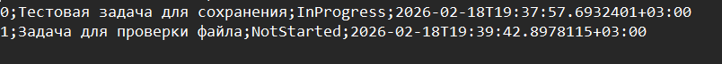

### TC-21 Проверка целостности файла (Ручная проверка)
**Описание:** Проверка физического наличия записи в файле CSV сразу после добавления.
**Последовательность действий:**
1. В приложении добавить задачу: `add Задача для проверки файла`.
2. Не закрывая приложение, открыть папку `Data` в проводнике.
3. Открыть файл `todos_{GUID}.csv` через Блокнот.
**Ожидаемый результат:**
- В конце файла появилась новая строка.
- Формат строки соответствует: `ID;"Задача для проверки файла";NotStarted;[Дата]`.
**Скриншоты:**
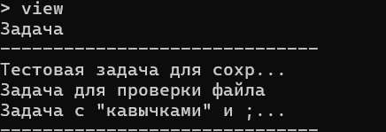

---

## 8. Парсинг строк и обработка ошибок

### TC-22 Корректный парсинг спецсимволов
**Описание:** Проверка обработки строк, содержащих символы разделители CSV (`;`) и кавычки (`"`).
**Последовательность действий:**
1. Ввести: `add Задача с "кавычками" и ; точкой с запятой`.
2. Перезапустить приложение (выход -> вход).
3. Ввести `view`.
**Ожидаемый результат:**
- Приложение загрузилось без ошибок.
- Текст задачи отображается корректно: `Задача с "кавычками" и ; точкой с запятой`.
- Строка не разбилась на смещенные колонки.
**Скриншоты:**
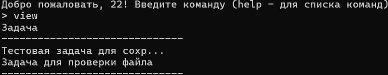

### TC-23 Обработка поврежденных строк (Error Handling)
**Описание:** Проверка поведения программы при попытке загрузить поврежденный файл.
**Предусловия:**
1. Закрыть приложение.
2. Открыть файл `todos_{GUID}.csv` в Блокноте.
3. Удалить дату в одной из строк или стереть половину строки (нарушить структуру CSV).
4. Сохранить файл.
**Последовательность действий:**
1. Запустить приложение.
2. Авторизоваться.
3. Посмотреть вывод консоли.
**Ожидаемый результат:**
- Приложение **не вылетает** (Crash).
- В консоль выводится сообщение об ошибке загрузки (согласно `try-catch` в `FileManager`).
- Либо список пуст, либо загружены только валидные задачи (в зависимости от реализации).
**Скриншоты:**

---

## 9. Undo / Redo (Отмена и Повтор)

### TC-24 Отмена добавления (Undo Add)
**Описание:** Отмена последнего действия добавления задачи.
**Последовательность действий:**
1. Ввести `add Ошибочная задача`.
2. Убедиться, что она добавилась (`view`).
3. Ввести `undo`.
4. Ввести `view`.
**Ожидаемый результат:**
- Сообщение "Действие отменено".
- Задача "Ошибочная задача" исчезла из списка.
**Скриншоты:**
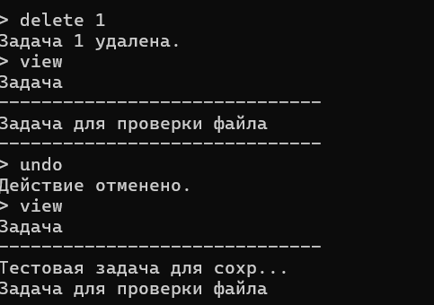

### TC-25 Отмена удаления (Undo Delete)
**Описание:** Восстановление случайно удаленной задачи.
**Последовательность действий:**
1. Удалить существующую задачу (например, индекс 1) командой `delete 1`.
2. Ввести `undo`.
3. Ввести `view`.
**Ожидаемый результат:**
- Сообщение "Действие отменено".
- Удаленная задача снова появилась в списке на прежнем месте.
**Скриншоты:**
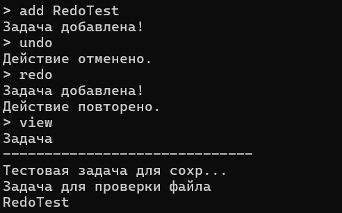

### TC-26 Undo/Redo при пустом стеке
**Описание:** Проверка реакции системы на вызов `undo`/`redo`, когда действий еще не совершалось.
**Последовательность действий:**
1. Перезапустить приложение и авторизоваться (история действий пуста).
2. Ввести `undo`.
3. Ввести `redo`.
**Ожидаемый результат:**
- Сообщения "Нечего отменять" и "Нечего повторять".
- Приложение продолжает работу, ошибок нет.
**Скриншоты:**
