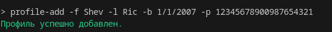
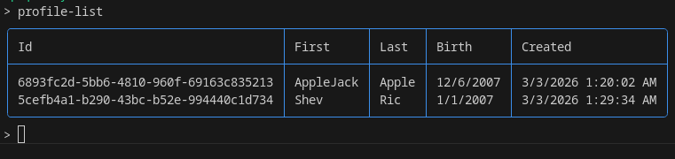
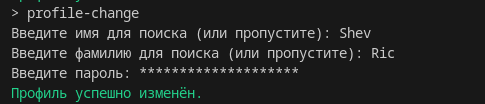
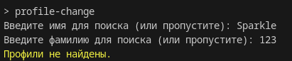
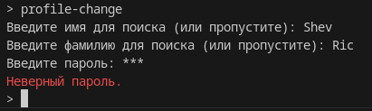
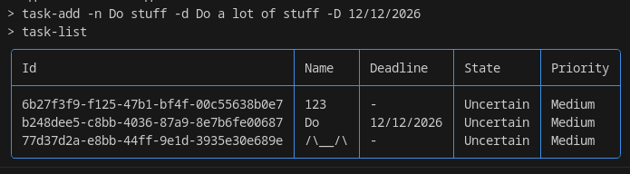
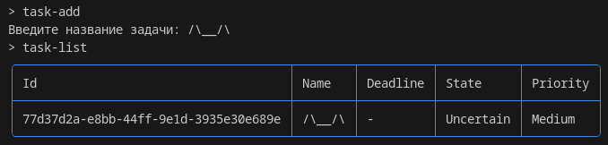
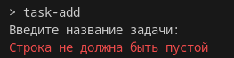
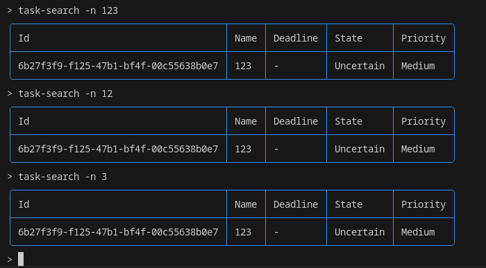
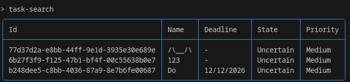

### TC-01 Создание нового пользователя
**Описание:**
Проверка корректного создания нового пользователя в системе.
**Предусловия:**
Приложение запущено.
**Последовательность действий:**
1. Запустить приложение.
2. Выбрать команду `profile-add`.
3. Ввести имя: `Shev`.
4. Ввести фамилию: `Ric`
5. Ввести пароль: `12345678900987654321`.
**Ожидаемый результат:**
- Профиль `Shev` успешно добавлен.
- В консоли отображается сообщение об успешном создании пользователя.
- Пользователь сохранён в файле данных.
**Скриншоты:**
- 
- 
### ТС-02 Смена пользователя
**Описание:**
Проверка корректной смены пользователя в системе.
**Предусловия:**
Приложение запущено. Существует как минимум два профиля в системе.
**Последовательность действий:**
1. Запустить приложение.
2. Выбрать команду: `profile-change`
3. Ввести имя: `Shev`.
4. Ввести фамилию: `Ric`.
5. Ввести пароль: `12345678900987654321`.
**Ожидаемый результат:**
- Профиль успешно изменён.
- В консоли отображается сообщение об успешном изменении пользователя
**Скриншоты:**
- 
### ТС-03 Ошибка авторизации профиля
**Описание:**
Проверка корректной системы авторизации и работы с ошибками.
**Последовательность действий:**
1. Запустить приложение.
2. Выбрать команду `profile-change`
3. Ввести имя и фамилию которых нет в системе, либо ввести данные существующего пользователя, но написать неверный пароль.
**Ожидаемый результат:**
- Произошла ошибка авторизации.
- В консли отображается сообщение о причине ошибки авторизации.
**скриншоты:**
- 
- 
### ТС-04 Создание задачи
**Описание:**
Проверка корректной работы системы создания задач.
**Последовательность действий:**
1. Запустить приложение.
2. Выбрать команду `task-add`
3. Ввести название `Do Stuff`
4. Ввести описание `Do a lot of stuff`
5. Ввести дедлайн `12/12/2026`
**Ожидаемый результат:**
- Задача была успешно создана.
**скриншоты:**
- 
### ТС-05 Создание задачи со служебными символами
**Описание:**
Проверка корректной обработки служебных символов при создании задачи.
**Последовательность действий:**
1. Запустить приложение.
2. Выбрать команду `task-add`
3. Ввести имя использующее служебные символы `/\__/\`
**Ожидаемый результат:**
- Задача была успешно создана
**скриншоты:**
- 
### ТС-06 Создание задачи с пустым именем
**Описание:**
Проверка обработки пустой строки имени при создании задачи.
**Последовательность действий:**
1. Запустить приложение.
2. Выбрать команду `task-add`
3. Ввести пустое название задачи.
**Ожидаемый результат:**
- Программа не примет данное название и попросит ввести другое
- В консоли отображается сообщение о том что строка не должна быть пустой.
**скриншоты:**
- 
### ТС-07 Поиск по имени
**Описание:**
Проверка корректной работы системы поиска задач.
**Последовательность действий:**
1. Запустить приложение.
2. Выбрать команду `task-search`
3. Ввести название задачи.
4. Повторять со 2 шага и проверять разные варианты ввода. 
**Ожидаемый результат:**
- Программа будет находить задачу.
- В консли отображается таблица с найденными задачами.
**скриншоты:**
- 
### ТС-08 Пустой поиск
**Описание:**
Проверка работы системы поиска задач при пустом вводе.
**Последовательность действий:**
1. Запустить приложение.
2. Выбрать команду `task-search`
3. Ничего не вводить
**Ожидаемый результат:**
- Программа найдёт все задачи, так как не были переданы апргументы.
- В консоли отображается таблица со всеми существующими задачами.
**скриншоты:**
- 